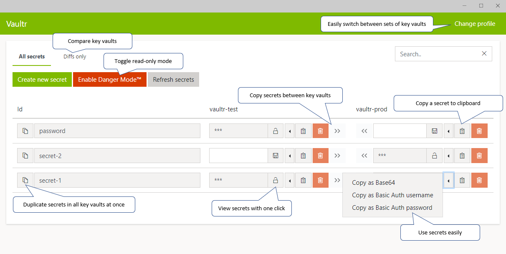

# Vaultr
A MAUI application to manage multiple KeyVaults at the same time, making comparing, copying and moving secrets between KeyVaults easy.

Download the latest build from the [released](https://github.com/ThomasBleijendaal/Vaultr/releases) page (sometimes you need to install the .cer file first before running the msix.). 
Or download the latest Visual Studio with MAUI workload and Compile and Deploy Vaultr yourself. 
